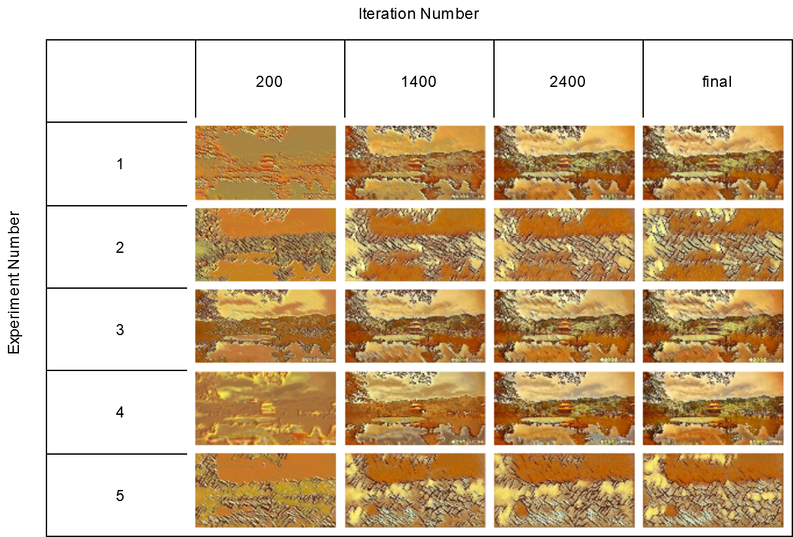
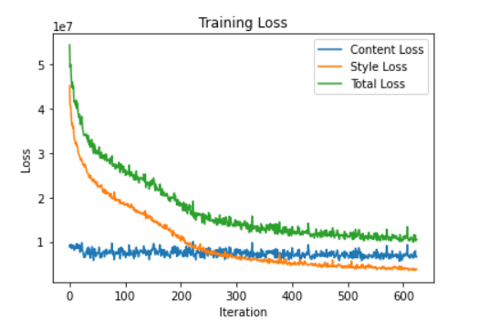
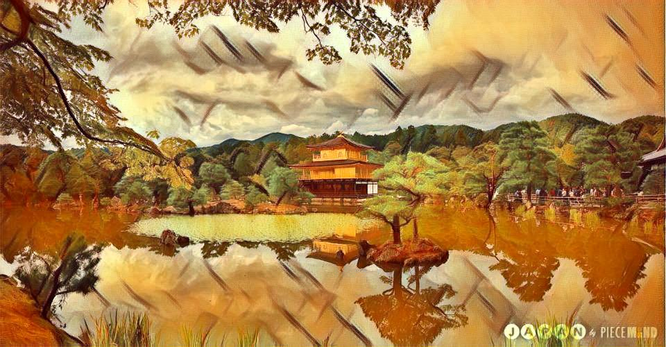

# Neural Style Transfer  [](https://colab.research.google.com/github/yash-choudhary/Neural-Style-Transfer/blob/master/Fast%20Neural%20Style%20Transfer.ipynb)

<p align="center">
  
</p>

According to Wikipedia, Neural Style Transfer (NST) also called Artistic Style Transfer refers to a class of software algorithms that manipulate digital images, or videos, in order to adopt the appearance or visual style of another image. NST algorithms are characterized by their use of deep neural networks for the sake of image transformation.

In simple words, Neural style transfer is the process of creating art using computers. It is the process of painting the contents of one image with the style of another.

## Our Content Image
<p align="center">
  
  <br>
  <em> Fig 1. Content Image</em>
</p>

## Our Style Image
<p align="center">
  
  <br>
  <em> Fig 2. Style Image</em>
</p>

## **How does NST work?**
<p align="center">
  
  <br>
  <em> Fig 3. Neural style transfer working</em>
</p>

First, Let's discuss the traditional approach of neural style transfer first given by Gatys et al. in there paper "A Neural Algorithm of Artistic Style".It was built on a very neat idea that, 

**It is possible to separate the style representation and content representations in a CNN, learnt during a computer vision task (e.g. image recognition task).**

Neural style transfer uses a pretrained convolution neural network. Then to define a loss function which blends two images seamlessly to create visually appealing art, NST defines the following inputs:

    1. A content image (c) — the image we want to transfer a style to
    2. A style image (s) — the image we want to transfer the style from
    3. An input (generated) image (g) — the image that contains the final result (the only trainable variable)

The basic idea behind this approach is that CNN pretrained on large image datasets develop an intuition of how images and objects in those images look in terms of content and style. The shallow layers of these networks are more concerned with content of the image like shapes and structural details. The deeper layers are good at understanding the texture and style of the image.

<p align="center">
  
  <br>
  <em>Fig 4. VGG16 laverwise extracted features</em>
</p>

So, content, style and generated images are passed through the network and the weigts of specific layers are compared using loss fuctions like content loss and style loss. 

**Content Loss**: The content cost function is making sure that the content present in the content image is captured in the generated image. As CNNs capture information about content in the higher levels, where the lower levels are more focused on individual pixel values, we use the top-most CNN layer to define the content loss function.

**Style Loss**:To extract the style information from the VGG network, we use all the layers of the CNN. Furthermore, style information is measured as the amount of correlation present between features maps in a given layer. Next, a loss is defined as the difference of correlation present between the feature maps computed by the generated image and the style image.

Then, an optimizer back-propagates and updates the pixel values of the generated image and the process repeats. This process of searching for pixel values is very slow and not at all practical for styling multiple images.

## The Problem: 
Each new content image will reset the generated image pixels and the process of pixel search needs to be done again. That makes the process very very slow and does not gurantee good results. Due these time and compute constraints, it cannot be implemented in production.


## The Solution: 
The solution is to generalize the approach, using something like a neural net that learns to apply a specific type of style on any input image. Although this approach is also not very good but it is much better than the previous one.

**Advantages**:
* Much faster than the traditional approach
* requires us to train the model only once per style

**Disadvantages**:
* Each style requires its own weights for the model which means it requires a lot of space to save weights for each type of style.

## Fast Neural Style Transfer
<p align="center">
  
  <br>
  <em>Fig 5. The Transfer Network</em>
</p>

Training a style transfer model requires two networks: a pre-trained feature extractor and a transfer network. The pre-trained feature extractor is used to avoid having to us paired training data. It’s usefulness arises from the curious tendency for individual layers of deep convolutional neural networks trained for image classification to specialize in understanding specific features of an image.

The pre-trained model enables us to compare the content and style of two images, but it doesn't actually help us create the stylized image. That’s the job of a second neural network, which we’ll call the transfer network. The transfer network is an image translation network that takes one image as input and outputs another image. Transfer networks typically have an encode-decoder architecture.

At the beginning of training, one or more style images are run through the pre-trained feature extractor, and the outputs at various style layers are saved for later comparison. Content images are then fed into the system. Each content image passes through the pre-trained feature extractor, where outputs at various content layers are saved. The content image then passes through the transfer network, which outputs a stylized image. The stylized image is also run through the feature extractor, and outputs at both the content and style layers are saved.

The quality of the stylized image is defined by a custom loss function that has terms for both content and style. The extracted content features of the stylized image are compared to the original content image, while the extracted style features are compared to those from the reference style image(s). After each step, only the transfer network is updated. The weights of the pre-trained feature extractor remain fixed throughout. By weighting the different terms of the loss function, we can train models to produce output images with lighter or heavier stylization. 

## Requirements:
1. Python == 3.7.6
2. Torch == 1.5.1
3. Torchvision == 0.6.0a0+35d732a
4. Numpy == 1.18.1
5. PIL == 5.4.1
6. tqdm == 4.45.0
7. Matplotlib == 3.2.1
8. OpenCV == 4.2.0.34
9. CUDA Version == 10.1

## Installation and Usage:

Clone this repo:
```
git clone https://github.com/yash-choudhary/Neural-Style-Transfer.git
```

Install the dependencies
```
pip3 install -r requirements.txt
```

Just open the provided Fast Neural Style Transfer.ipynb in colab or your local GPU enabled machine. Run the **fast_trainer** function to train your custom model or use the provided pretrained model with the **test_image** function to generate results.
```
For reading purpose or more visually appealing results, you can just open the provided html file in a browser.
```

You can also see this notebook on [Kaggle.](https://www.kaggle.com/yashchoudhary/fast-neural-style-transfer)

## Experiments
I experimented with different layer formats and style and content weights and there are the results of each experiment.
| **Experiment Number** |  **1**  |  **2**  |  **3**  |  **4**  |  **5**  |
|-----------------------|:-------:|:-------:|:-------:|:-------:|:-------:|
| **batch_size**        |    4    |    4    |    4    |    8    |    4    |
| **epochs**            |    10   |    4    |    2    |    20   |    2    |
| **style_weight**      |   1e10  |  10e10  |  10e10  |  10e10  |  10e20  |
| **content_weight**    |   1e5   |   10e3  |   10e5  |   10e5  |   10e3  |
| **maxpool/avgpool**   | maxpool | maxpool | maxpool | avgpool | maxpool |
<br>
You can access the resuling images of each experiment in "experiments" folder of this repo.<br>

<p align="center">
  
  <br>
  <em>Fig 6. Experiment Results</em>
</p>

## Result
The 3 best outputs from my models are:

<p align="center">
  
  <br>
  <em>Fig 7. Training Loss</em>
</p>
<p align="center">
  
  <br>
  <em>Fig 8. Best Result 1 [More Weight to Style]</em>
</p>
<p align="center">
  
  <br>
  <em>Fig 9. Best Result 2 [Balanced Style and content]</em>
</p>
<p align="center">
  
  <br>
  <em>Fig 10. Best Result 3 [More Weight to Content]</em>
</p>

Please find detailed experiment results [here](https://drive.google.com/drive/folders/13jTfhQVB2qojOD3cb9EF7-Uy_afYUbDE?usp=sharing).

## Important Links
1. Train Dataset Link: http://images.cocodataset.org/zips/test2017.zip 
2. Style Image: https://github.com/myelinfoundry-2019/challenge/raw/master/picasso_selfportrait.jpg 
3. Content Image: https://github.com/myelinfoundry-2019/challenge/raw/master/japanese_garden.jpg 
4. Best Model: https://www.dropbox.com/s/7xvmmbn1bx94exz/best_model.pth?dl=1

## References:
1. [Style Transfer Guide](https://www.fritz.ai/style-transfer/)
2. [Breaking Down Leon Gatys’ Neural Style Transfer in PyTorch](https://towardsdatascience.com/breaking-down-leon-gatys-neural-style-transfer-in-pytorch-faf9f0eb79db)
3. [Intuitive Guide to Neural Style Transfer](https://towardsdatascience.com/light-on-math-machine-learning-intuitive-guide-to-neural-style-transfer-ef88e46697ee)
4. [A Neural Algorithm of Artistic Style ByLeon A. Gatys, Alexander S. Ecker, Matthias Bethge](https://arxiv.org/abs/1508.06576)
5. [Perceptual Losses for Real-Time Style Transfer and Super-Resolution by Justin Johnson, Alexandre Alahi, Li Fei-Fei](https://arxiv.org/abs/1603.08155)
6. [Neural Style Transfer on Real Time Video (With Full implementable code)](https://towardsdatascience.com/neural-style-transfer-on-real-time-video-with-full-implementable-code-ac2dbc0e9822)
7. 
8. 
9. 
